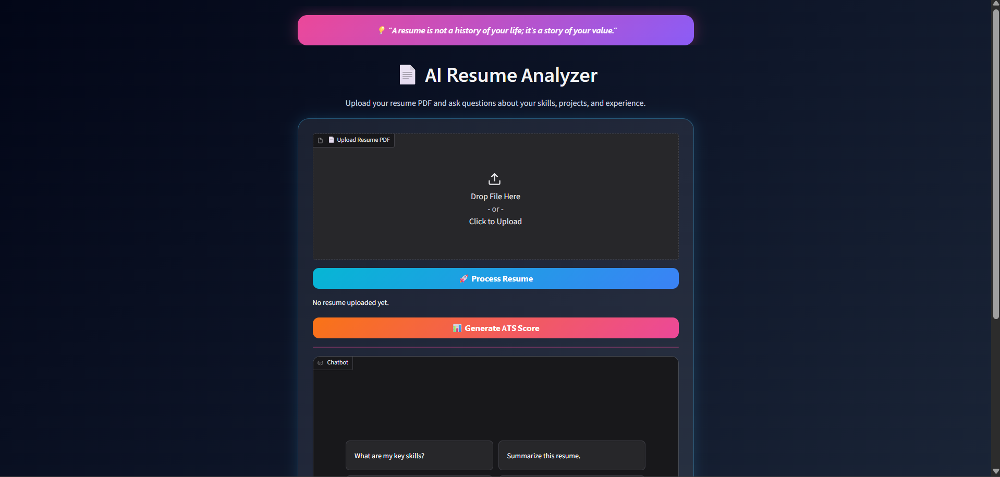
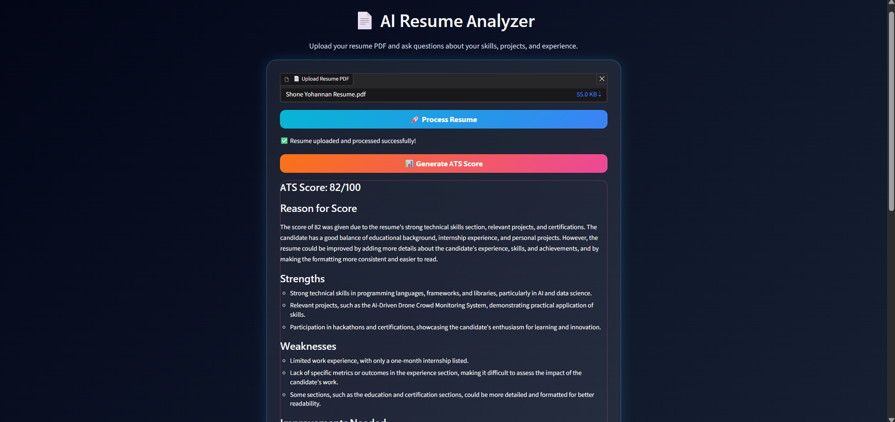
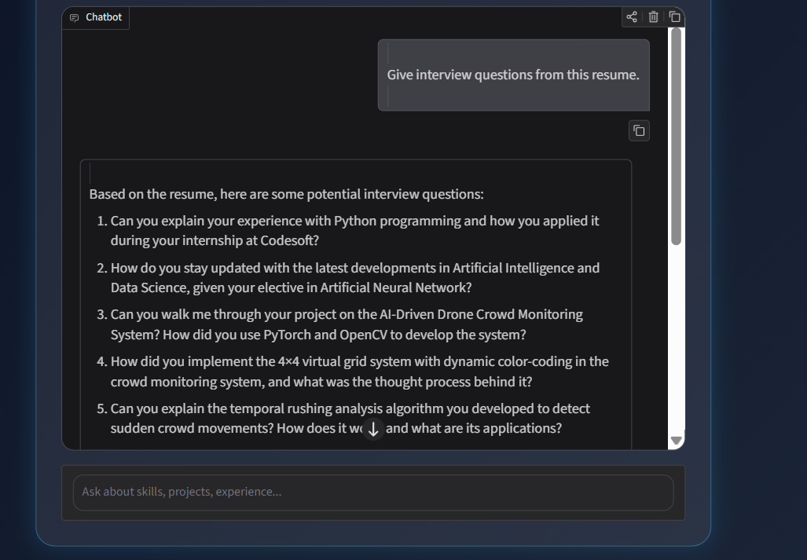

# 📄 AI Resume Analyzer

An AI-powered Resume Analyzer that enables users to upload their resume in PDF format and interact with it through natural language. The application extracts resume content, evaluates it using a Large Language Model (LLM), generates an ATS-style analysis, and answers resume-related questions in real time.

---

## 🚀 Features

* 📄 Upload resumes in PDF format
* 🤖 AI-powered Resume Question & Answer
* 📊 ATS-style Resume Score (out of 100)
* ✅ Resume Strength Analysis
* ⚠️ Resume Weakness Detection
* 💡 Personalized Improvement Suggestions
* 💼 Best Suitable Job Role Recommendations
* 🎯 Interview Question Generation
* 🎨 Modern dark-themed Gradio interface
* 🔒 Secure API key management using `.env`

---

# 📸 Screenshots

## 🏠 Home Page

> Add screenshot here



---

## 📊 ATS Resume Evaluation

> Add screenshot here



---

## 🤖 Resume Chat Interface

> Add screenshot here



---

# 🛠️ Tech Stack

| Technology    | Purpose                              |
| ------------- | ------------------------------------ |
| Python        | Backend Logic                        |
| Gradio        | Interactive Web UI                   |
| Groq API      | Large Language Model (Llama 3.3 70B) |
| PyPDF         | PDF Text Extraction                  |
| Python Dotenv | Secure API Key Management            |

---

# ⚙️ How It Works

### Step 1

Upload a resume in PDF format.

↓

### Step 2

The application extracts all readable text using **PyPDF**.

↓

### Step 3

The extracted resume content is stored temporarily.

↓

### Step 4

The user can:

* Ask questions about the resume
* Generate an ATS Score
* Identify strengths and weaknesses
* Receive resume improvement suggestions
* Generate interview questions
* Discover suitable job roles

↓

### Step 5

The Groq-hosted Llama 3.3 model analyzes the resume and generates intelligent responses.

---

# 📂 Project Structure

```text
Resume_Chatbot/
│
├── app.py
├── requirements.txt
├── README.md
├── .gitignore
├── .env (Not included)
└── images/
    ├── home.png
    ├── ats-score.png
    └── chatbot.png
```

---

# 💻 Installation

## Clone the Repository

```bash
git clone https://github.com/ShoneYohannan/Resume_Chatbot.git

cd Resume_Chatbot
```

---

## Install Dependencies

```bash
pip install -r requirements.txt
```

---

## Configure Environment Variables

Create a `.env` file in the project directory.

```env
GROQ_API_KEY=your_groq_api_key
```

---

## Run the Application

```bash
python app.py
```

Open your browser and visit:

```text
http://127.0.0.1:7860
```

---

# 💬 Example Questions

You can ask questions such as:

* What are my key skills?
* Summarize this resume.
* Which project has the highest impact?
* What job roles suit this resume?
* Generate interview questions from this resume.
* What are the weaknesses in this resume?
* How can I improve my resume?
* If you were a recruiter, would you shortlist this resume?
* What technologies are mentioned in this resume?
* Which certifications improve my profile?

---

# 📊 ATS Analysis Includes

The ATS evaluation provides:

* ATS Score (/100)
* Resume Strengths
* Resume Weaknesses
* Improvement Suggestions
* Suitable Career Roles

---

# 🎯 Use Cases

* Students preparing for placements
* Fresh graduates
* Internship applicants
* Job seekers
* Resume review before applying
* Interview preparation

---

# 🔮 Future Enhancements

* 📈 Resume Skill Gap Analysis
* 📄 Multi-Resume Comparison
* 🎯 Job Description Matching
* 📊 Resume Analytics Dashboard
* 🌐 Cloud Deployment
* 📥 Downloadable ATS Report (PDF)
* 🌍 Multi-language Resume Support

---

# 🔒 Security

* API keys are securely managed using environment variables.
* Sensitive credentials are excluded from version control using `.gitignore`.

---

# 🤝 Contributing

Contributions are welcome.

1. Fork the repository.
2. Create a feature branch.
3. Commit your changes.
4. Push the branch.
5. Open a Pull Request.

---

# 👨‍💻 Author

**Shone Yohannan**

GitHub: https://github.com/ShoneYohannan


